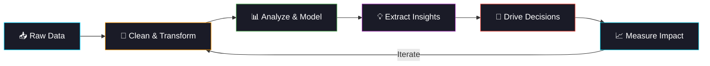

<!-- ═══════════════════════════════════════════════════════════════ -->
<!-- HEADER -->
<!-- ═══════════════════════════════════════════════════════════════ -->


<p align="center">
  
</p>

<p align="center">
  <a href="https://linkedin.com/in/belal-ahmid/">
    
  </a>&nbsp;
  <a href="https://youtube.com/@BakTech">
    
  </a>&nbsp;
  <a href="https://x.com/belalsq1">
    
  </a>&nbsp;
  <a href="https://instagram.com/belallahmed_">
    
  </a>&nbsp;
  <a href="mailto:belal.ahmed121sq1@gmail.com">
    
  </a>
</p>

<br>

<!-- ═══════════════════════════════════════════════════════════════ -->
<!-- ABOUT ME -->
<!-- ═══════════════════════════════════════════════════════════════ -->

##  &nbsp;About Me


```js
const belal = {
    title: "Data Analyst & Data Engineer",
    education: "Computer Engineering — AIET (2025)",
    location: "Egypt | Open to Remote",

    dailyStack: ["SQL", "Python", "Power BI", "Excel"],
    learning: ["dbt", "Airflow", "Snowflake"],

    motto: "Data without insight is just noise."
};
```

<br>

- 🔭 &nbsp;Building **ETL pipelines** & interactive **dashboards**
- 📊 &nbsp;Passionate about **data cleaning**, **modeling** & **KPI tracking**
- 🧠 &nbsp;Experienced in analyzing **user behavior** & **engagement patterns**
- 🎯 &nbsp;Goal: Become a **top-tier Data Engineer** building scalable systems
- ⚡ &nbsp;Fun fact: I automated **hackathon data analysis** for 800+ participants

<br clear="both">

---

<!-- ═══════════════════════════════════════════════════════════════ -->
<!-- TECH STACK -->
<!-- ═══════════════════════════════════════════════════════════════ -->

##  &nbsp;Tech Stack

<table align="center">
<tr>
<td align="center" width="150"><b>📋 Languages</b></td>
<td align="center" width="150"><b>🗄️ Databases</b></td>
<td align="center" width="150"><b>📊 Analytics</b></td>
<td align="center" width="150"><b>⚙️ Tools</b></td>
<td align="center" width="150"><b>☁️ Cloud</b></td>
</tr>
<tr>
<td align="center">
  <br><sub>Python</sub><br>
  <br><sub>SQL / Bash</sub>
</td>
<td align="center">
  <br><sub>PostgreSQL</sub><br>
  <br><sub>MySQL</sub>
</td>
<td align="center">
  <br>
  <br>
  
</td>
<td align="center">
  <br><sub>Git</sub><br>
  <br><sub>Docker</sub>
</td>
<td align="center">
  <br><sub>AWS</sub><br>
  <br>
  
</td>
</tr>
</table>

<br>

<p align="center">
  
  
  
  
  
  
  
</p>

---

<!-- ═══════════════════════════════════════════════════════════════ -->
<!-- FEATURED PROJECT -->
<!-- ═══════════════════════════════════════════════════════════════ -->

##  &nbsp;Featured Project

<table>
<tr>
<td width="50%">

### 🏆 Hackathon Management — Data Analysis

> Extracted & analyzed **800+ participants' data** across **12 hackathons** to uncover engagement patterns and drive product decisions.

**Key KPIs Tracked:**
- 📉 **52% user drop-off** after Day 1 → Proposed gamification
- 📊 **46.8% activation rate** → Improved onboarding flow
- 🏅 **Hard tasks: 47.9% avg score** → Added hint system
- 🕐 **Peak activity: 9–11 PM** → Optimized notifications
- 🔄 **29.4% retention rate** → Built loyalty program

**Tools:** `Python` `Pandas` `Excel` `Pivot Tables` `Matplotlib` `Power BI`

</td>
<td width="50%">

**What I Did:**

```
📁 7 Relational Tables (Normalized)
📊 10 Professional Charts
📋 19 KPIs Across 5 Categories
💡 7 Actionable Recommendations
```

**Analysis Categories:**
| Category | Examples |
|----------|----------|
| 🟢 Engagement | DAU, Actions/User, Activation |
| 🔴 Drop-off | Day-over-day retention curve |
| 🟡 Performance | Score %, Acceptance rate |
| 🔵 Behavioral | Peak hours, User actions |
| 🟣 Business | Conversion funnel, Churn |

</td>
</tr>
</table>

---

<!-- ═══════════════════════════════════════════════════════════════ -->
<!-- GITHUB STATS -->
<!-- ═══════════════════════════════════════════════════════════════ -->

##  &nbsp;GitHub Stats

<p align="center">
  
  
</p>

<p align="center">
  
</p>

<p align="center">
  
</p>

---

<!-- ═══════════════════════════════════════════════════════════════ -->
<!-- TROPHIES -->
<!-- ═══════════════════════════════════════════════════════════════ -->

<p align="center">
  
</p>

---

<!-- ═══════════════════════════════════════════════════════════════ -->
<!-- DATA MINDSET -->
<!-- ═══════════════════════════════════════════════════════════════ -->

##  &nbsp;How I Think About Data

<p align="center">



</p>

---

<!-- ═══════════════════════════════════════════════════════════════ -->
<!-- QUOTE & FOOTER -->
<!-- ═══════════════════════════════════════════════════════════════ -->

<p align="center">
  
</p>

<br>

<p align="center">
  
</p>


<h3 align="center">
  
  &nbsp;"Data is useless without insight — I build both."&nbsp;
  
</h3>
