<!-- ═══════════════════════════════════════════════════════════════ -->
<!-- HEADER -->
<!-- ═══════════════════════════════════════════════════════════════ -->


<p align="center">
  
</p>

<br>

<p align="center">
  <a href="https://linkedin.com/in/belal-ahmid/">
    
  </a>&nbsp;
  <a href="https://youtube.com/@BakTech">
    
  </a>&nbsp;
  <a href="https://x.com/belalsq1">
    
  </a>&nbsp;
  <a href="https://instagram.com/belallahmed_">
    
  </a>&nbsp;
  <a href="mailto:belal.ahmed121sq1@gmail.com">
    
  </a>
</p>

<br>

<!-- ═══════════════════════════════════════════════════════════════ -->
<!-- ABOUT ME -->
<!-- ═══════════════════════════════════════════════════════════════ -->

## 👨‍💻 About Me

```ts
const belal = {
    role: "Full-Stack Developer & Data/BI Professional",
    education: "Computer Engineering — AIET (2025)",
    location: "Alexandria, Egypt | Open to Remote",

    softwareEngineering: ["Next.js", "React", "TypeScript", "Django"],
    dataAndBI: ["SQL", "Power BI", "Excel", "Python"],
    infrastructure: ["Docker", "Linux", "DigitalOcean", "Vercel"],

    approach: "Build the product. Measure the impact. Improve with data."
};
```

I work across two connected tracks: **software engineering** and **data & business intelligence**. I build end-to-end web products, backend APIs, and database-driven systems, while also creating analytical models, dashboards, and data workflows that turn product activity into measurable business insight.

- 🌐 Building responsive web applications, APIs, and production-ready full-stack systems
- 📊 Transforming raw data into SQL models, Power BI dashboards, KPIs, and recommendations
- 🧩 Connecting product development with analytics to support better decisions
- 🚀 Comfortable taking projects from idea and implementation to deployment and measurement
- 🎯 Open to **Full-Stack, Frontend, Backend, Data Analyst, and BI Developer** opportunities

> **Portfolio structure:** My repositories are grouped into **Full-Stack Engineering** and **Data & BI** projects so each recruiter can quickly review the work relevant to the role.

<p align="center">
  <a href="#-full-stack-engineering-projects"><b>Full-Stack Projects</b></a>
  &nbsp;•&nbsp;
  <a href="#-data--bi-projects"><b>Data & BI Projects</b></a>
  &nbsp;•&nbsp;
  <a href="#-technical-toolkit"><b>Technical Toolkit</b></a>
</p>

---

<!-- ═══════════════════════════════════════════════════════════════ -->
<!-- TECHNICAL TOOLKIT -->
<!-- ═══════════════════════════════════════════════════════════════ -->

## 🛠️ Technical Toolkit

### 🌐 Full-Stack Engineering

<p align="center">
  
</p>

<p align="center">
  
  
  
  
  
</p>

### 📊 Data, Analytics & BI

<p align="center">
  
  
  
  
  
</p>

<p align="center">
  
  
  
  
  
  
</p>

### 🗄️ Databases, DevOps & Deployment

<p align="center">
  
</p>

<p align="center">
  
  
  
  
</p>

### 📚 Currently Expanding

<p align="center">
  
  
  
  
</p>

---

<!-- ═══════════════════════════════════════════════════════════════ -->
<!-- FULL-STACK PROJECTS -->
<!-- ═══════════════════════════════════════════════════════════════ -->

## 🌐 Full-Stack Engineering Projects

### 🎓 Roshed — Academy Management System

> A full-stack platform built to support academy operations through a modern web interface and a scalable backend architecture.

- Built the frontend using **Next.js, React, TypeScript, and Tailwind CSS**
- Developed the backend using **Django and Python**
- Worked with relational data, API integration, deployment, and environment configuration
- Deployed the frontend on **Vercel** and the backend on **DigitalOcean**
- Applied a production-focused approach covering maintainability, scalability, and deployment reliability

**Stack:** `Next.js` `React` `TypeScript` `Tailwind CSS` `Django` `Python` `PostgreSQL` `Vercel` `DigitalOcean`

---

### 🤖 RoleFit — AI Resume Optimizer

> An AI-powered product that compares a candidate's resume with a job description to identify alignment, missing skills, and improvement opportunities.

- Designed around a real job-search problem with a clear user workflow
- Combines web application development with AI-assisted text analysis
- Focuses on practical recommendations instead of generic resume scoring
- Built with product usability, structured outputs, and future scalability in mind

**Focus:** `Full-Stack Development` `AI Integration` `Resume Analysis` `Product Design`

---

<!-- ═══════════════════════════════════════════════════════════════ -->
<!-- DATA PROJECTS -->
<!-- ═══════════════════════════════════════════════════════════════ -->

## 📊 Data & BI Projects

### 🏆 Hackathon Management — Data Analysis

> Extracted and analyzed data for **800+ participants** across **12 hackathons** to uncover engagement patterns and support product decisions.

**Key findings and KPIs:**

- 📉 **52% user drop-off** after Day 1 → Recommended gamification improvements
- 📊 **46.8% activation rate** → Identified onboarding optimization opportunities
- 🏅 **47.9% average score on hard tasks** → Recommended a structured hint system
- 🕐 **Peak activity between 9–11 PM** → Supported better notification timing
- 🔄 **29.4% retention rate** → Proposed loyalty and engagement initiatives

**Project Output:**

```text
7 normalized relational tables
10 professional visualizations
19 KPIs across 5 analysis categories
7 actionable business recommendations
```

**Tools:** `Python` `Pandas` `Excel` `Pivot Tables` `Matplotlib` `Power BI`

---

### 📣 Marketing Campaign Performance Dashboard

> A SQL and Power BI project designed to evaluate campaign performance and convert marketing data into clear business insights.

- Analyzed campaign reach, engagement, conversion, and channel performance
- Built reusable calculations and business-focused KPIs
- Designed an interactive dashboard for faster performance comparison
- Highlighted high-performing campaigns and areas requiring optimization

**Tools:** `SQL` `Power BI` `DAX` `Data Modeling` `Dashboard Design`

---

### 💼 Interactive Sales Dashboard

> A professional Power BI dashboard for monitoring sales performance, trends, products, customers, and business growth.

- Built an interactive reporting experience with clear visual hierarchy
- Tracked revenue, sales trends, product performance, and customer behavior
- Applied data modeling and DAX measures to support reliable analysis
- Focused on decision-ready insights rather than decorative visualizations

**Tools:** `Power BI` `DAX` `Excel` `Data Cleaning` `Data Visualization`

---

<!-- ═══════════════════════════════════════════════════════════════ -->
<!-- PRODUCT MINDSET -->
<!-- ═══════════════════════════════════════════════════════════════ -->

## 💡 How I Approach Products & Data

```mermaid
graph LR
    A["🎯 Understand the Problem"] --> B["🧩 Design the Solution"]
    B --> C["🌐 Build the Product"]
    C --> D["📥 Capture Reliable Data"]
    D --> E["📊 Analyze Performance"]
    E --> F["💡 Generate Insights"]
    F --> G["🚀 Improve the Product"]
    G --> C

    style A fill:#1a1b27,stroke:#00D4FF,color:#fff
    style B fill:#1a1b27,stroke:#7B2FFF,color:#fff
    style C fill:#1a1b27,stroke:#4CAF50,color:#fff
    style D fill:#1a1b27,stroke:#FF9800,color:#fff
    style E fill:#1a1b27,stroke:#1976D2,color:#fff
    style F fill:#1a1b27,stroke:#E91E63,color:#fff
    style G fill:#1a1b27,stroke:#F44336,color:#fff
```



---

<!-- ═══════════════════════════════════════════════════════════════ -->
<!-- GITHUB STATS -->
<!-- ═══════════════════════════════════════════════════════════════ -->

## 📈 GitHub Activity

<p align="center">
  
  
</p>

<p align="center">
  
</p>

<p align="center">
  
</p>

---

<!-- ═══════════════════════════════════════════════════════════════ -->
<!-- FOOTER -->
<!-- ═══════════════════════════════════════════════════════════════ -->

<h3 align="center">Let's build useful products and turn their data into better decisions.</h3>

<p align="center">
  <a href="mailto:belal.ahmed121sq1@gmail.com">
    
  </a>
</p>

<br>


<h3 align="center">
  ⚡ &nbsp;"I build software products and the data systems that make them better."&nbsp; ⚡
</h3>
